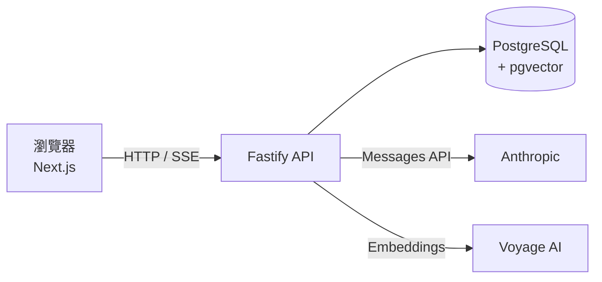
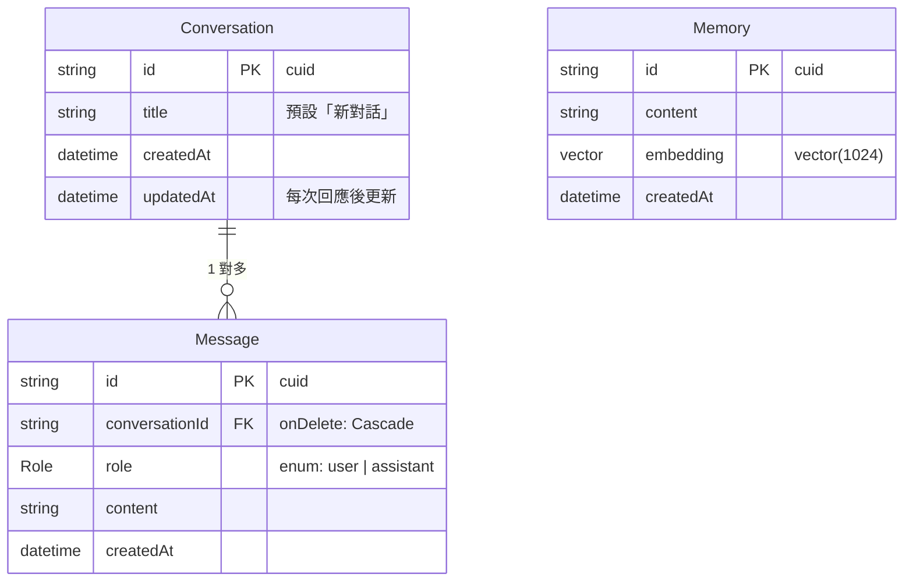

# 系統設計與架構決策

> **這份文件是第六章單元 1 的產出，課程已經幫你準備好了。**
>
> 單元 1 教的是系統設計的方法論 —— 需求釐清、容量估算、API 設計、資料模型與索引、
> 擴展性取捨。那個單元不寫程式，最後的產出就是這份文件。
>
> 課程直接附上它，所以你可以**直接開始單元 2**。
>
> **想自己練一次？** 單元 1 的講義有完整的提示詞流程（Plan Mode 討論 → 寫成文件）。
> 跑完之後拿你的版本跟這份對照 —— 內容不會一模一樣，那是正常的。
> 要比的是**涵蓋面**：
>
> - 需求有沒有分成功能性 / 非功能性 / 明確不做的？
> - 每條非功能性需求有沒有對應到一個技術決定？
> - 容量估算有沒有寫出計算過程？
> - 每個索引有沒有對應到一個具體的查詢 SQL？
> - 擴展性章節有沒有標出「不可逆的決定」？
>
> 這幾件事都有，你的版本就是合格的。

> ### ⚠️ 這份文件描述的是「最終目標系統」
>
> 裡面寫的 SSE 串流、RAG 記憶、部署設定，都是**第六、七章做完之後**的樣子。
>
> 功能會在單元 2–7 逐步實作，**每個單元的範圍以該單元的提示詞為準**——
> 不要因為這裡寫了串流跟 RAG，就在單元 3 一次做完。
>
> 目前只有單元 2 的提示詞會用到這份文件（第 5 節的 ERD）。

**實作進度對照**

| 章節 | 在哪個單元實作 |
|---|---|
| 5. 資料模型 | 單元 2 |
| 6. `POST /chat`（非串流） | 單元 3 |
| 6. SSE 事件格式 | 單元 5 |
| 6. `/conversations` 系列 | 單元 6 |
| 6. `/memories` 系列、7.9–7.10 向量檢索 | 單元 7 |
| 7.3–7.6 部署與連線數 | 第七章單元 5 |

---

## 1. 系統概觀

一個單人使用的 AI 聊天機器人。前端 Next.js、後端 Fastify、資料庫 PostgreSQL + pgvector。
回應以 SSE 逐字串流，對話歷史持久化，並透過向量檢索跨對話記住使用者的個人偏好。



三個自有元件、兩個外部服務。沒有快取層、沒有訊息佇列、沒有負載均衡器 ——
這些在目前的量級下都是負債而非資產，理由見第 7 節。

**部署形態（第七章）**

| 元件 | 本機 | 線上 |
|---|---|---|
| 前端 | `next dev` | Vercel |
| Fastify | `tsx watch` | Cloud Run |
| PostgreSQL | Docker 容器 | Cloud SQL |
| Anthropic / Voyage | 同一個雲端 API | 同一個雲端 API |

元件數量不變，只是換誰在跑。程式碼不用改，只有 `DATABASE_URL` 與 `WEB_ORIGIN` 的值不同。

---

## 2. 需求

### 功能性需求

| # | 需求 |
|---|---|
| F1 | 使用者送出訊息，取得 AI 回應 |
| F2 | 同一個對話內有上下文（多輪） |
| F3 | 對話歷史可以列出、可以回去看、可以刪除 |
| F4 | 跨對話記住使用者的個人偏好 |
| F5 | 生成中可以中斷，已產生的內容保留 |

### 非功能性需求

**每一條都必須對應到一個技術決定，否則不算有效需求。**

| # | 需求 | 逼出什麼決定 |
|---|---|---|
| N1 | 第一個字要在 1 秒內出現 | **必須串流** → SSE，排除「等模型講完再回傳」 |
| N2 | 重新整理不能掉資料 | **必須持久化** → 訊息寫進 PostgreSQL，不是只放在 React state |
| N3 | 單人使用，不需要登入 | **省掉整個 auth 系統** → 沒有 User 表、沒有 session、沒有權限判斷 |
| N4 | 中斷後不再產生 token | 後端要 `AbortController`，並在 request close 時中止上游連線 |
| N5 | 記憶功能故障不能讓對話不能用 | 記憶檢索包 try/catch，失敗降級為「這次不帶記憶」 |
| N6 | 個人專案量級（見第 3 節） | 不做快取層、不做分片、不做 MQ、不做限流 |

### 明確不做

寫下來的目的：三個月後有人問「為什麼沒有 X」，答案是「當初決定不做」而不是「忘了」。

- 多租戶 / 多使用者隔離
- 權限與角色
- 金流
- 多語系（介面固定繁體中文）
- 附件與圖片上傳
- 對話搜尋（全文檢索）
- 訊息編輯與重新生成

---

## 3. 容量估算

原則：**數量級對就好。** 55 MB 跟 80 MB 的差別不重要，55 MB 跟 5.5 TB 的差別才重要。

### 情境 A — 個人專案（1 個使用者）

```
假設：1 個使用者，一天聊 50 則訊息

每天訊息數 = 50 × 2（一問一答）    = 100 則
每則平均   = 500 字 ≈ 1.5 KB
每天資料量 = 100 × 1.5 KB          = 150 KB
一年       = 150 KB × 365          ≈ 55 MB
```

**結論：** 單台 PostgreSQL 綽綽有餘。不需要分庫分表、不需要冷熱資料分離、不需要歸檔策略。

### 情境 B — 10 萬 DAU

```
假設：100,000 DAU，每人每天 50 則訊息

每天訊息數 = 100,000 × 100         = 10,000,000 則
每天資料量 = 10M × 1.5 KB          = 15 GB
一年       = 15 GB × 365           ≈ 5.5 TB

平均 QPS   = 10,000,000 / 86,400   ≈ 116
尖峰 QPS   = 平均 × 3（抓 2–5 倍）  ≈ 350
```

**結論：** 350 QPS 對 PostgreSQL 還好，但 5.5 TB 要開始規劃歸檔與分片。

**注意這個估算的盲點：** 上面算的是「一般請求」的 QPS。我們的 `POST /chat` 是 SSE，
**一條連線會佔住數秒到數十秒**。所以真正的壓力指標是**並行連線數**，不是 QPS ——
這會直接影響 Cloud Run 的 `--concurrency` 設定（見第 7.3 節）。

### 情境 C — AI token 成本

多輪對話每次都要重送完整歷史，所以 input token 是累積的：

```
每則回應假設 500 output token
第 N 輪的 input ≈ 前面所有訊息的總和

一次 20 輪的對話，input token 總量約：
  500 + 1,000 + 1,500 + ... + 10,000 ≈ 105,000 token

→ 對話越長，成本接近「平方」成長，不是線性
```

**這個數字直接影響架構決定：** 長對話一定要處理，手段是截斷、摘要、或只送相關片段。
第 8 節列為「尚未決定」，單元 7 的 RAG 是這個問題的部分解法。

---

## 4. 技術選型

**每一列都要有「代價」欄位。只列好處的選型表沒有價值。**

| 決定 | 為什麼選它 | 代價 |
|---|---|---|
| **SSE**（而非 WebSocket） | 我們的資料流是單向的（伺服器 → 前端）。SSE 就是普通 HTTP，不用連線升級、不用心跳、代理相容性好 | 只能單向。未來要做多人協作或雙向互動得換掉 |
| **SSE**（而非輪詢） | 延遲低、不浪費請求 | 長連線佔用伺服器資源，且擴容判斷變複雜 |
| **`fetch` + ReadableStream**（而非 `EventSource`） | `EventSource` 只能發 GET、不能帶 body，而我們要 POST 訊息 | 失去瀏覽器內建的自動重連，要自己處理斷線 |
| **PostgreSQL + pgvector**（而非專用向量庫） | 一套資料庫解決關聯資料與向量檢索，少維護一個系統 | 向量檢索效能不如專用方案；上千萬筆向量時要重新評估 |
| **Prisma** | 型別安全的查詢 API、宣告式 schema、migration 進版控 | `vector` 型別不支援，所有向量操作要走 `$queryRaw` |
| **Anthropic Messages API** | 本專案主題 | 無狀態，多輪對話要自己重送完整歷史（見第 3 節成本） |
| **Voyage AI**（embedding） | Anthropic 沒有 embedding API，Voyage 是官方推薦搭配 | 多一組金鑰、多一個外部相依。已用 N5 的降級策略隔離 |
| **monorepo + `packages/shared`** | 前後端共用同一份 zod schema，契約只寫一次，改壞了編譯期就爆 | 建置設定較複雜；部署到 Vercel 要指定 Root Directory |
| **無狀態應用伺服器** | 可水平擴展、掛一台不影響其他、部署可隨時替換 | 每個請求都要查資料庫撈歷史。**這個交易很划算，見第 7.1 節** |

**模型與參數**

| 項目 | 值 | 備註 |
|---|---|---|
| 模型 | `claude-opus-5` | 換 `claude-sonnet-5` 省錢，只需改 `lib/anthropic.ts` 一行 |
| `max_tokens` | 8192 | 串流輸出，不必擔心 HTTP timeout |
| Embedding 模型 | `voyage-4-lite` | |
| 向量維度 | 1024 | **必須與 `schema.prisma` 的 `vector(1024)` 一致** |

---

## 5. 資料模型

### ERD



`Memory` 刻意**不屬於任何對話** —— 它是跨對話的長期記憶，這是單元 7 的整個重點。

### 為什麼不用 JSON 欄位存整串訊息

考慮過 `Conversation.messages JSON` 這個「一個欄位搞定」的做法，四個問題否決了它：

| 問題 | 說明 |
|---|---|
| 無法查單則訊息 | 得把每個對話的 JSON 撈出來在應用層過濾 |
| 無法分頁 | 一個對話 500 則，只想顯示最新 20 則？整包讀出來 |
| 寫入放大 | 新增一則 = 讀整包 + 改 + 寫回整包，對話越長越慢 |
| **無法建索引** | 最致命的一項 |

### 索引設計

**每個索引都對應到一個真實查詢。沒有對應查詢的索引就不該建** ——
索引佔空間（資料的 10–30%），而且每次寫入都要更新。

**索引 1：`Conversation(updatedAt)`**

```sql
-- 側欄列出最近的對話（GET /conversations）
SELECT id, title, "updatedAt"
FROM "Conversation"
ORDER BY "updatedAt" DESC
LIMIT 30;
```

**索引 2：`Message(conversationId, createdAt)`** — 複合索引

```sql
-- 撈某個對話的完整訊息（多輪對話、GET /conversations/:id）
SELECT role, content, "createdAt"
FROM "Message"
WHERE "conversationId" = $1
ORDER BY "createdAt" ASC;
```

**欄位順序不能反。** `(conversationId, createdAt)`：

1. 用第一欄做等值篩選
2. 篩完之後第二欄天然有序，**不需要額外排序步驟**

寫成 `(createdAt, conversationId)` 的話第一欄用不上，這個查詢就吃不到索引。

> **通則：等值比對的欄位放前面，範圍查詢或排序的放後面。**

**`Memory.embedding`：現在不建索引**

相似度不是可排序的量，B-tree 無法處理。pgvector 提供 HNSW 索引，但：

- 目前記憶筆數是幾十筆等級，全表掃描 + 逐列算距離的成本可忽略
- HNSW 是**近似搜尋**，會犧牲召回率換速度，現在沒有必要付這個代價

**加索引的時機：** 記憶數量到數萬筆、或 `EXPLAIN ANALYZE` 顯示這段查詢成為瓶頸時。

### Prisma 的 `Unsupported` 型別

```prisma
embedding Unsupported("vector(1024)")
```

Prisma 不認識 pgvector 的 `vector` 型別。`Unsupported` 讓它能正確產生 migration SQL，
但**不會**替這個欄位生成型別安全的查詢 API。

**實務影響：** 所有 `embedding` 的讀寫都必須走 `$queryRaw` / `$executeRaw`，
向量字面值要寫成 `'[0.1,0.2,...]'`（方括號）並 cast 成 `::vector`。

---

## 6. API 契約

Base URL：本機 `http://localhost:3001`

| 方法 | 路徑 | 用途 | 回應 |
|---|---|---|---|
| `GET` | `/health` | 環境檢查：DB 連線 + pgvector extension | `{ status, db, pgvector, ... }` |
| `POST` | `/chat` | 送訊息，**SSE 串流回應** | `text/event-stream` |
| `GET` | `/conversations` | 側欄清單，`updatedAt` 由新到舊，最多 30 筆 | `ConversationSummary[]` |
| `GET` | `/conversations/:id` | 單一對話 + 完整訊息（時間排序） | `ConversationDetail` |
| `DELETE` | `/conversations/:id` | 刪除對話（訊息由 `onDelete: Cascade` 連帶刪除） | `204` |
| `GET` | `/memories` | 列出全部記憶，最新在前 | `Memory[]` |
| `POST` | `/memories` | 新增記憶，自動計算 embedding | `Memory` |
| `DELETE` | `/memories/:id` | 刪除記憶 | `204` |

### `POST /chat` 的 request 設計

```ts
{ message: string, conversationId?: string }
```

**刻意不讓前端送完整歷史。** 曾考慮 `{ messages: [...全部歷史...] }`，三個理由否決：

| 角度 | 問題 |
|---|---|
| 頻寬 | 第 50 輪時每次都要上傳整串歷史 |
| **安全** | 前端可竄改歷史，例如塞一則假的 `assistant` 訊息來操縱模型 |
| 一致性 | 歷史有兩個來源（前端 state 與資料庫），遲早不同步 |

**不要信任前端送上來的任何東西。** 歷史一律由後端從資料庫撈。

### SSE 事件格式

**不直接轉發 Anthropic SDK 的事件** —— 那會讓前端跟 SDK 版本綁死。
自訂四個事件，SDK 改版時只需改後端的轉換層（防腐層）。

```ts
{ type: 'start',  conversationId: string }  // 對話已建立/確認，前端可更新網址
{ type: 'delta',  text: string }            // 一小段文字
{ type: 'done',   message: Message }        // 結束，附上已存入資料庫的完整訊息
{ type: 'error',  message: string }         // 出錯
```

**SSE 必要的 header**

| Header | 為什麼 |
|---|---|
| `Content-Type: text/event-stream; charset=utf-8` | 少了 charset 中文會亂碼 |
| `Cache-Control: no-cache, no-transform` | |
| `Connection: keep-alive` | |
| **`X-Accel-Buffering: no`** | 阻止反向代理緩衝。**本機測不出這個問題，一部署就會壞** |

另外：用 `reply.raw.writeHead()` 直接寫 header 會繞過 Fastify 的 reply 物件，
導致 `@fastify/cors` 準備的 header 沒被送出。必須把 `reply.getHeaders()` 一併帶上。

### 錯誤格式

```ts
{ error: { code: string, message: string } }   // message 為繁體中文
```

| 狀況 | 狀態碼 |
|---|---|
| 驗證失敗（空訊息、超過 10,000 字） | `400` |
| 對話 / 記憶不存在 | `404` |
| 上游 API 或內部錯誤 | `500` |

### 環境變數

| 變數 | 必填 | 預設 | 說明 |
|---|---|---|---|
| `DATABASE_URL` | ✅ | — | |
| `PORT` | | `3001` | **線上由平台指定，不可寫死** |
| `NODE_ENV` | | `development` | |
| `WEB_ORIGIN` | | `http://localhost:3000` | CORS 白名單，部署後要改成實際前端網址 |
| `ANTHROPIC_API_KEY` | | — | 未設定時聊天不可用，但伺服器仍可啟動供 `/health` 檢查 |
| `VOYAGE_API_KEY` | | — | 未設定時自動略過記憶功能（對應 N5） |

全部在啟動時用 zod 一次驗證完，失敗直接 `exit(1)`。理由：漏設定要在啟動時就爆，
而不是跑到某一行才拿到 `undefined`。

---

## 7. 擴展性分析

### 7.1 無狀態 — 最重要、也最不可逆的決定

```
有狀態：對話歷史存在伺服器記憶體
  → 使用者的請求必須打到同一台
  → 那台掛了，資料就沒了
  → 加機器沒有用

無狀態：對話歷史存在資料庫
  → 任何一台都能處理任何請求
  → 掛一台，其他台照常服務
  → 加機器 = 加吞吐量
```

**代價：** 每個請求都要查資料庫撈歷史。
**回報：** 可以無限水平擴展。這個交易非常划算。

**為什麼它不可逆：** 現在做是免費的（反正都要查資料庫）；
等到有五萬行程式碼、狀態散落在各處，再改成無狀態是重寫等級的工程。

**已知例外：** SSE 連線本身有狀態 —— 連線建立後就綁在某一台伺服器上直到結束。
目前情境不受影響（要推的內容就是這個請求的回應）。
但若未來要做「從別處推播給特定使用者」，就需要 Redis Pub/Sub 之類的機制。

**同一原則的體現：** Anthropic Messages API 本身也是無狀態的 —— 這正是為什麼
多輪對話必須每次重送完整 `messages` 陣列。

### 7.2 負載均衡

| 項目 | 現在 | 量大時 |
|---|---|---|
| 實例數 | 1 | LB + 多實例 |
| L4 / L7 | 不適用 | Cloud Run 內建 L7 |
| 分配演算法 | 不適用 | **Least Connections** —— SSE 是長連線，Round Robin 會讓部分機器塞滿 |
| Health check | `/health` 已具備 | 同一個端點即為 LB 判斷依據 |

`/health` **必須真的查資料庫**，不能只回 `200` —— 否則資料庫掛了 LB 仍會把流量送進來。

### 7.3 擴容與並行

Cloud Run 自動水平擴容，**判斷依據是並行請求數**。

我們的 SSE 請求會佔住連線數十秒 → **即使 QPS 不高，並行數也可能很高**，
可能觸發過度擴容。設定 `--concurrency` 時必須考慮這一點。

### 7.4 反向代理的緩衝陷阱

Nginx 等反向代理預設會緩衝回應，會讓串流變成「等很久、然後一次全部出現」。

**最麻煩的是本機測不出來** —— 本機沒有反向代理。
解法是 `X-Accel-Buffering: no`，必須在寫 SSE 時就加上，不能等部署後再說。

### 7.5 訊息佇列 — 為什麼不用

MQ 的價值是把「接收」與「處理」解耦，適用於：處理很慢、流量尖峰削峰、需要重試。

**我們的情境相反：使用者正在等著看逐字回應，同步等待就是要的行為。**
丟進佇列回「稍後通知你」會直接摧毀產品體驗。

**判準：使用者需要立刻看到結果嗎？** 需要 → 同步；不需要 → 考慮 MQ。

**該加的時機：** 出現「批次摘要 100 個檔案」這類使用者不會盯著看的功能時。

### 7.6 資料庫擴展路徑

**順序不能亂，先做便宜的。**

| 步驟 | 做法 | 現在 |
|---|---|---|
| 0 | **加索引** —— 成本最低效果最大。用 `EXPLAIN ANALYZE`，看到 `Seq Scan` 就是警訊 | ✅ 已做兩個 |
| 1 | 連線池 | 第七章設定 |
| 2 | 讀寫分離 —— 代價是複製延遲（剛送完訊息重整可能看不到） | 不做 |
| 3 | 分片 —— 最後手段，跨片查詢痛苦且難回頭 | 不做 |

**serverless 特有的連線數陷阱（第七章會實際遇到）**

```
Cloud Run 自動擴容        → 合理
每個實例開連線池          → 合理
Cloud SQL 連線數有上限     → 合理
─────────────────────────────
三者湊在一起              → too many connections
```

100 實例 × 每實例 10 條 = 1,000 條連線，而 `db-f1-micro` 的上限只有幾十條。

**這個問題在架構圖上看不出來 —— 只有把「元件會怎麼變化」想過一遍才會發現。**

解法（由淺到深）：

| 層次 | 做法 | 我們做嗎 |
|---|---|---|
| 1 | 連線字串加 `?connection_limit=1` | ✅ 第七章 |
| 2 | `--max-instances=10`（同時是帳單保險絲） | ✅ 第七章 |
| 3 | PgBouncer / Managed Connection Pooling | 有量再說 |

### 7.7 快取

**這個系統本質上很難快取** —— AI 回應每次不同、對話內容個人化。

兩處例外值得做：

| 對象 | 效益 |
|---|---|
| Anthropic **prompt caching** | 多輪對話的前段每次相同，可省該部分約 90% input token |
| **embedding 快取** | 同一段文字的向量固定不變 |

一般的多層快取（CDN / Redis）在此無用武之地。**快取不是萬靈丹，要看資料特性。**

### 7.8 限流

**現在不做**，但要知道風險：每個請求都會呼叫付費 API，
沒有限流的話惡意使用者可在數分鐘內燒光額度。

| 演算法 | 特性 |
|---|---|
| 固定視窗 | 簡單，但有邊界問題（59 秒 60 次 + 61 秒 60 次 = 2 秒內 120 次） |
| 滑動視窗 | 修正邊界問題，需存更多狀態 |
| **Token Bucket** | 允許短暫爆發，最貼近實際使用行為（連發三則訊息是正常的） |

有真實流量後：LB 層擋大流量攻擊，應用層做每使用者限流。

### 7.9 向量檢索擴展

```sql
SELECT id, content, embedding <=> $1::vector AS distance
FROM "Memory" ORDER BY distance ASC LIMIT 5;
```

無索引 = 全表掃描 + 逐列計算距離。100 筆瞬間完成，100 萬筆不可用。

**pgvector 的 HNSW** 建立多層跳躍圖，但是**近似搜尋（ANN）**，不保證找到真正最近的結果。
可調參數：`m`、`ef_construction`（建索引時）、`ef_search`（查詢時，越大越準越慢）。

**這是速度與召回率的取捨。** 對「找相關記憶」而言 95% 的召回率完全足夠 ——
漏掉一筆邊緣相關的記憶，使用者感覺不出來。

**換專用向量庫（Pinecone / Qdrant / Milvus）的時機：** 上千萬筆向量，或需要複雜的過濾條件。

### 7.10 檢索品質的隱性風險

**RAG 故障時看起來像沒故障：**

| 狀況 | 使用者看到 |
|---|---|
| 檢索正常 | 好回答 |
| 檢索失敗（0 筆） | 普通回答，**無錯誤訊息** |
| 檢索到不相關內容 | 有點怪的回答，**無錯誤訊息** |

**因此檢索層必須獨立驗證**，不能靠「輸出看起來正確」推論。

兩個設計上的防護：

- **距離門檻 0.5** —— `LIMIT 5` 一定會回五筆，就算全部不相關。
  不設門檻會把「使用者住在台北」塞進一個問 TypeScript 的對話裡
- **`input_type` 區分 `document` / `query`** —— 用錯不會報錯，但檢索品質會下降

### 7.11 取捨總表

| 面向 | 個人專案（現在） | 百萬用戶 | 不可逆？ |
|---|---|---|---|
| 應用伺服器 | 1 個實例 | LB + 自動擴容 | |
| **無狀態** | ✅ 已經是 | ✅ 必要條件 | **⚠️ 是** |
| **資料模型** | 正規化三表 | 同左 + 分區 | **⚠️ 是** |
| **API 契約**（不信任前端歷史） | ✅ 已經是 | 同左 | **⚠️ 是** |
| 資料庫 | 單台 PostgreSQL | 主從複製 + 讀寫分離 + 分片 | |
| 連線池 | `connection_limit=1` + max-instances | PgBouncer / Managed Pooling | |
| 索引 | 兩個複合索引 | 加分區、部分索引 | |
| 向量檢索 | 全表掃描 | HNSW，或專用向量庫 | |
| 快取 | 只用 prompt caching | Redis + CDN 多層 | |
| 限流 | 不做 | 每使用者 token bucket | |
| MQ | 不用 | 批次任務、通知 | |
| 監控 | 看 log | APM、追蹤、告警 | |

**右欄現在一項都不做。** 不是因為不重要，而是現在做等於浪費 —— 浪費開發時間，
並且長期增加維護成本。

**但標記 ⚠️ 的三項現在就必須做對**，那些改起來是重寫等級。

---

## 8. 尚未決定的事

| 議題 | 說明 | 何時要決定 |
|---|---|---|
| **長對話的處理策略** | 第 3 節算出 input token 接近平方成長。截斷（丟失早期上下文）／摘要（多一次 API 呼叫）／向量檢索（複雜度高）三者尚未定案 | 出現 30 輪以上的實際對話時 |
| **記憶的產生方式** | 目前記憶靠手動新增。自動從對話抽取的話，如何避免存進雜訊？ | 記憶功能有實際使用者時 |
| **記憶的更新與衝突** | 使用者偏好改變時（例如從 Tailwind 改用 CSS Modules），舊記憶怎麼失效？現在只能手動刪除 | 同上 |
| **距離門檻 0.5 的普適性** | 這個值是用人造向量測出來的，尚未在大量真實記憶上驗證 | 記憶累積到數百筆時重新評估 |
| **金鑰管理** | 第七章部署時用 `--set-env-vars`，金鑰會留在 shell history。正式環境應改用 Secret Manager | 這個服務要給自己以外的人用時 |
| **監控與告警** | 目前只有 log。沒有錯誤率、延遲、成本的可觀測性 | 有真實使用者時 |

---

## 附錄：本文件與實作的對應

| 章節 | 對應程式碼 |
|---|---|
| 5. 資料模型 | `packages/db/prisma/schema.prisma` |
| 6. API 契約 | `packages/shared/src/index.ts`、`apps/api/src/routes/` |
| 6. SSE header | `apps/api/src/lib/sse.ts` |
| 7.10 檢索品質 | `apps/api/src/lib/memory.ts` |
| 6. 環境變數 | `apps/api/src/env.ts` |
